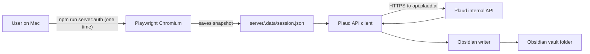

# Plaud Server Exporter

A small server-side companion to the
[`plaud-exporter`](https://github.com/ksandrpetrov/plaud-exporter) Chrome
extension. It uses Plaud's internal API directly (the same endpoints the
extension calls), writes Obsidian-friendly Markdown to disk, and keeps a
JSON sync index so it never re-downloads anything it has already exported.

## Why

Running the extension means opening Chrome and clicking the popup. This tool
runs on a Linux server next to your other personal services and exports your
own recordings on a timer.

## How



For background, see [`docs/server-exporter-research.md`](docs/server-exporter-research.md).

## Layout

```
plaud-server-exporter/
├── plaud-exporter/                # git submodule (the Chrome extension)
├── server/
│   ├── src/                       # CLI, auth, API client, sync runner, writer
│   ├── tests/
│   └── package.json
├── docs/
├── deploy/systemd/
├── .env.example
└── package.json                   # root scripts (server:auth, server:sync, …)
```

The submodule keeps `common/syncCore.js` and `common/exportPathUtils.js` as
the single source of truth shared with the extension.

## Quick start (local)

Run every command below from the **repository root** (the folder that contains
`package.json` and `.env.example`), not from `docs/`. If you are elsewhere in the
tree:

```bash
cd "$(git rev-parse --show-toplevel)"
```

```bash
git clone --recurse-submodules https://github.com/<you>/plaud-server-exporter.git
cd plaud-server-exporter

npm install --workspaces
npx playwright install chromium
cp .env.example .env
# edit .env: set PLAUD_EXPORT_ROOT (e.g. ~/plaud-test-exports on Mac) and PLAUD_TIMEZONE

# one-time interactive Plaud login (opens Chromium)
npm run server:auth

# preview what would be exported
npm run server:sync -- --dry-run

# real sync (summaries only by default)
npm run server:sync
```

## CLI

| Command | Effect |
|---------|--------|
| `npm run server:auth` | Interactive login via Playwright; saves session snapshot |
| `npm run server:auth -- --refresh` | Headless refresh against the existing profile |
| `npm run server:auth -- --import file.json` | Import a DevTools-prepared snapshot |
| `npm run server:sync` | Sync summaries (Markdown) |
| `npm run server:sync -- --dry-run` | Plan without writing anything; no audio API calls |
| `npm run server:sync -- --summary-only` | Force summaries-only (alias for `--no-audio`) |
| `npm run server:sync -- --no-audio` | Force summaries-only even if env opted in |
| `npm run server:sync -- --audio-too` | Also fetch audio files |
| `npm run server:status` | Print config, session presence, last sync stats |
| `node server/src/cli/index.js logout` | Delete the saved session snapshot |

Exit codes: `0` success, `1` per-file/network errors, `2` auth, `3` `plaud_changed`, `4` another sync is already running.

## Output

```
{vault}/Plaud/
├── 2026/
│   ├── 2026-05-17 - Weekly review.md
│   └── 2026-05-18 - Customer call.md
└── _attachments/
    └── Customer call.audio.mp3       # only with --audio-too
```

Each `.md` file contains **only the meeting summary** (readable Markdown).
Sync metadata (stable id, hash, paths) is stored in `server/.data/sync-index.json`,
not inside the note. Failures are written to `{vault}/_errors/*.md`.

## Docs

- [`docs/getting-started-ru.md`](docs/getting-started-ru.md) — **пошаговый запуск локально и на сервере (RU)**
- [`server/README.md`](server/README.md) — server exporter quick reference
- [`docs/stabilization-audit.md`](docs/stabilization-audit.md) — architecture audit and acceptance checklist
- [`docs/stabilization-result.md`](docs/stabilization-result.md) — what changed in the stabilization pass
- [`docs/server-exporter-research.md`](docs/server-exporter-research.md) — how the extension works, what we reuse, what we replace
- [`docs/security.md`](docs/security.md) — secret handling, rotation, compromise
- [`docs/server-deploy.md`](docs/server-deploy.md) — Ubuntu deployment, systemd, logrotate
- [`docs/troubleshooting.md`](docs/troubleshooting.md) — common failures and fixes
- [`docs/obsidian-sync.md`](docs/obsidian-sync.md) — Syncthing / Git / Obsidian Sync options
- [`docs/devtools-data-needed.md`](docs/devtools-data-needed.md) — what to grab from DevTools if you cannot run Playwright

## Development

```bash
npm run lint
npm test
npm run verify              # checks submodule + import graph
npm run test:submodule      # runs the extension's tests as well
```
