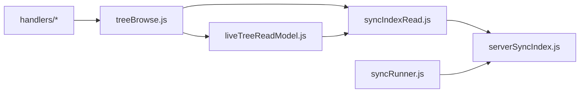
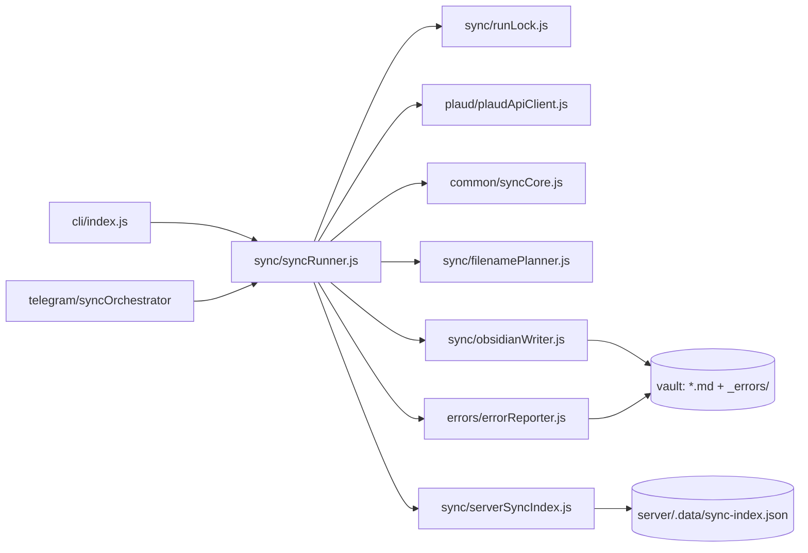

# Архитектура Plaud Server Exporter

Один git-репозиторий, две среды выполнения (Node CLI + Chrome MV3), и небольшой набор общих чистых модулей. Цель
документа — дать новому разработчику (или AI-агенту) карту кода за минуту: где что лежит, какие файлы общие, и что
трогать при изменении X.

## Карта репозитория

```text
plaud-server-exporter/
├── server/                      Node CLI + Telegram bot
│   ├── src/
│   │   ├── cli/                 Точка входа: auth | sync | status | bot | logout
│   │   ├── config/              dotenv + getters (singleton)
│   │   ├── auth/                OAuth (oauth-tokens.json) + Playwright snapshot (session.json)
│   │   ├── plaud/               Plaud HTTP API + folders/tags
│   │   ├── sync/                Цикл экспорта, индекс, lock, filename planner, writer
│   │   ├── errors/              Классификация ошибок + report в _errors/
│   │   ├── telegram/            Бот: loop, handlers/*, messages/*, дерево, scheduler
│   │   ├── security/            redact для логов и отчётов
│   │   ├── http/                webServer: /healthz, /connect (Docker + nginx)
│   │   └── logger.js
│   └── tests/                   node:test (см. ниже)
├── browser-extension/           Chrome MV3 extension
│   ├── common/                  Shared (3) + extension-only (см. ниже)
│   ├── background/              Модули SW: downloads, tabs, locale
│   ├── background.js            Service worker (~130 LOC, bootstrap)
│   ├── background/handlers/     onMessage handlers (export, sync, settings, status)
│   ├── features/audioExport/    Plaud API + smart sync (barrel audioExport.js)
│   ├── content.js               Bootstrap; handlers — content/contentHandlers.js
│   └── popup/                   UI расширения
├── docs/                        Документация (RU)
├── deploy/                      systemd, logrotate, docker-compose, Ansible
├── Dockerfile                   Production image (бот + HTTP)
└── scripts/                     verify-shared-contract.js, ci-deploy-remote.sh, migrate-legacy-data.sh
```

## Общий код (shared common)

Семь файлов — формальный контракт между server и extension. Меняешь один — обновляешь оба consumer'а и оба набора
тестов. Список зафиксирован в [`scripts/verify-shared-contract.js`](../scripts/verify-shared-contract.js) (
`SHARED_CONTRACT_FILES`).

| Файл                                                                                                | Что в нём                                                                                                                | Server-side consumers                                                                                      |
| --------------------------------------------------------------------------------------------------- | ------------------------------------------------------------------------------------------------------------------------ | ---------------------------------------------------------------------------------------------------------- |
| [`browser-extension/common/syncCore.js`](../browser-extension/common/syncCore.js)                   | Стабильные ID, хеши саммари, `determineSyncAction` (new / unchanged / metadata-only / re-download), нормализация индекса | `syncRunner.js`, `serverSyncIndex.js`, `errorReporter.js`                                                  |
| [`browser-extension/common/exportPathUtils.js`](../browser-extension/common/exportPathUtils.js)     | Санитизация имён, даты-префиксы, `MAX_FULL_PATH_LENGTH`, режимы экспорта                                                 | `filenamePlanner.js`, `obsidianWriter.js`                                                                  |
| [`browser-extension/common/plaudFolders.js`](../browser-extension/common/plaudFolders.js)           | Парсинг filetags, `attachFolderSegmentsToFiles`, локализованный Unfiled, Trash                                           | Re-export в `server/src/plaud/plaudFolders.js`; `recordingsApi.js`, `vaultTree.js`, `liveTreeReadModel.js` |
| [`browser-extension/common/plaudRecordingIds.js`](../browser-extension/common/plaudRecordingIds.js) | `extractRawRecordingId`, `normalizeHexRecordingId`, `normalizePlaudRecordingId`                                          | `recordingsApi.js`                                                                                         |
| [`browser-extension/common/plaudTitles.js`](../browser-extension/common/plaudTitles.js)             | `normalizeHumanTitle`, `TITLE_KEYS`, `pickRawTitleFromFile`                                                              | `recordingsApi.js`, `summariesApi.js`, `audioExport.js`                                                    |
| [`browser-extension/common/plaudSummaries.js`](../browser-extension/common/plaudSummaries.js)       | `stripPlaudInlineAssets` — удаление битых Plaud CDN-картинок из markdown                                                 | `summariesApi.js` (re-export в `plaudApiClient.js` для тестов)                                             |
| [`browser-extension/common/plaudRecordings.js`](../browser-extension/common/plaudRecordings.js)     | Парсинг `/file/simple/web`, нормализация записей, pagination stop, fan-out по папкам Plaud                               | `recordingsApi.js`                                                                                         |

> Каталог `browser-extension/` — Chrome MV3 расширение в монорепо (не git-submodule). Импорты server'а резолвятся как
> `../../../browser-extension/common/...`.

Остальные модули `browser-extension/common/` — **только** для расширения, server их не использует:

| Модуль                   | Назначение                                                                                                                           |
| ------------------------ | ------------------------------------------------------------------------------------------------------------------------------------ |
| `runtimeMessages.js`     | Константы `action` для popup ↔ service worker ↔ content; тест `runtimeMessages.test.js` сверяет литералы в `popup.js` / `content.js` |
| `storageUtils.js`        | `chrome.storage` + загрузка/сохранение индекса sync                                                                                  |
| `uiComponents.js`        | Статусный UI на странице Plaud                                                                                                       |
| `plaud-i18n-messages.js` | Каталоги строк popup / background                                                                                                    |

Service worker вынесен в `background/`: `chromeDownloadBridge.js` (`chrome.downloads`), `tabMessaging.js` (
`sendMessage` + re-inject), `bgLocale.js`. В `features/audioExport/` из `audioExport.js` выделены
`plaudBrowserSession.js` (сессия из `localStorage`), `plaudRecordingIdScraper.js`, `plaudCollisionPaths.js` (имена и
коллизии в sync-папке). При недоступном direct API экспорт завершается без DOM-автоматизации и без изменения записей.

Команда `npm run verify` из корня проверяет, что все семь shared-файлов существуют и что относительные импорты из
`server/src/` резолвятся. CI запускает её на каждом push/PR.

### Слои Telegram ↔ sync-index (read path)



Запись индекса — только через `syncRunner` / `saveSyncIndex`. Бот читает через [`syncIndexRead.js`](../server/src/sync/syncIndexRead.js).

## Точки входа

| Команда                 | Что запускается                                                                                                                                                               |
| ----------------------- | ----------------------------------------------------------------------------------------------------------------------------------------------------------------------------- |
| `npm run server:auth`   | [`server/src/cli/index.js`](../server/src/cli/index.js) → OAuth в браузере (только Mac) → `server/.data/oauth-tokens.json`; с `--playwright` — snapshot-вход в `session.json` |
| `npm run server:sync`   | CLI → [`server/src/sync/syncRunner.js`](../server/src/sync/syncRunner.js)                                                                                                     |
| `npm run server:status` | CLI → JSON со статусом конфига и сессии                                                                                                                                       |
| `npm run server:bot`    | CLI → [`server/src/telegram/index.js`](../server/src/telegram/index.js) (long-poll + scheduler)                                                                               |
| Chrome                  | manifest.json → `background.js` + `content.js`                                                                                                                                |

## Auth и режимы API

В репозитории **два рабочих стека доступа к Plaud**, и это осознанно: ни один из них
не покрывает всё.

| `PLAUD_AUTH_MODE`  | `PLAUD_API_MODE`  | Поведение                                                      |
| ------------------ | ----------------- | -------------------------------------------------------------- |
| `auto` (по умолч.) | `web` (по умолч.) | OAuth-токены, если они есть, иначе snapshot; web API + папки   |
| `oauth`            | `official`        | OAuth + Developer API; плоский vault, без зеркалирования папок |
| `snapshot`         | `web`             | Только snapshot-вход через Playwright                          |

Разводит режимы [`auth/plaudSessionMode.js`](../server/src/auth/plaudSessionMode.js),
грузит сессию [`auth/loadPlaudSession.js`](../server/src/auth/loadPlaudSession.js).
Важная деталь: OAuth-сессия **всегда** уходит на official API — access token выдан для
`platform.plaud.ai/developer/api` и web-эндпоинты его не принимают.

**Почему snapshot нельзя убрать.** Папки Plaud, Unfiled и Trash живут только в web API
(`/filetag/` + fan-out по папкам). Official Developer API их не документирует, поэтому
`PLAUD_MIRROR_FOLDERS=true` и группировка в дереве Telegram работают исключительно на
web-стеке, а он требует JWT из `localStorage` Plaud Web — то есть snapshot.

**Почему OAuth нельзя убрать.** Только он даёт refresh-токен, то есть работу без
периодического ручного re-auth на Mac и `scp` на сервер.

Оба входа выполняются **только на Mac** — на VPS Playwright не запускаем.

## Plaud API: поверхность

Web API (база — `session.apiBase`, по умолчанию `https://api.plaud.ai`; переопределяется
через `plaud_user_api_domain` с проверкой `*.plaud.ai`):

| Метод | Путь                              | Назначение                  | Доп. заголовки |
| ----- | --------------------------------- | --------------------------- | -------------- |
| GET   | `/file/simple/web?…`              | Пагинированный список       | —              |
| GET   | `/filetag/` (fallback `/filetag`) | Виртуальные папки/теги      | —              |
| GET   | `/ai/query_note`                  | Заметки саммари             | `file-id`      |
| GET   | `<note.data_link>`                | Тело markdown (внешний URL) | без auth Plaud |
| GET   | `/file/temp-url/{fileId}`         | Presigned URL аудио         | —              |

`/file/temp-url` сервер **не вызывает** — sync summary-only, это закреплено тестом
`syncAudioDefault.test.js`. Эндпоинт указан, потому что его использует расширение.

Official Developer API (база — `PLAUD_API_BASE`, по умолчанию
`https://platform.plaud.ai/developer/api`):

| Метод | Путь                                      | Назначение                          |
| ----- | ----------------------------------------- | ----------------------------------- |
| GET   | `/open/third-party/files/`                | Список записей (page / page_size)   |
| GET   | `/open/third-party/files/{id}`            | Запись + `note_list[].data_content` |
| POST  | `/oauth/third-party/access-token`         | Обмен кода на токены                |
| POST  | `/oauth/third-party/access-token/refresh` | Обновление токенов                  |

Транспорт web-стека ([`plaud/httpTransport.js`](../server/src/plaud/httpTransport.js)):

- **Редирект региона:** `status === -302`, `data.domains.api` — смена `apiBase` и один повтор.
- **Backoff:** до 3 попыток, 500 ms → 8 s; на таймаутах, 429, 502–504, сети. На 401/403 — не ретраим.
- **Таймаут запроса:** 45 с (`PLAUD_API_TIMEOUT_MS`), `AbortController`.
- Любой 401/403 → `PlaudAuthError` → exit `2` и `lastAuthError` в `status.json`.

## Поток sync



1. CLI или Telegram-бот запускает `runSync`.
2. `runLock` берёт файловый лок (`server/.data/sync.lock`, `O_EXCL`).
3. Plaud API → список записей + саммари по каждой.
4. `syncCore.determineSyncAction` + (на server) `refineSyncActionForDisk` решают: new / unchanged / metadata-only /
   re-download / restore missing file.
5. `filenamePlanner` + `obsidianWriter` пишут `.md` атомарно; при metadata-only — `rename`/`move`.
6. `serverSyncIndex` сохраняет индекс (atomic + `.bak`).
7. Ошибки классифицируются и пишутся в `{vault}/_errors/*.md`.

### Слои обработки ошибок

| Слой                 | Модуль                                                                                                                        | Когда                                                                                                                  |
| -------------------- | ----------------------------------------------------------------------------------------------------------------------------- | ---------------------------------------------------------------------------------------------------------------------- |
| Top-level throw      | [`syncFailureMapper.js`](../server/src/sync/syncFailureMapper.js)                                                             | CLI и бот после `runSync` (lock, auth, plaud_changed, exit code); `recordAuthFailureIfNeeded` пишет auth в status.json |
| Per-file / per-stage | [`errorReporter.js`](../server/src/errors/errorReporter.js) + [`errorClassifier.js`](../server/src/errors/errorClassifier.js) | Внутри `syncRunner` на каждую запись или этап list/fetch                                                               |
| UX copy              | `sync/syncProgressPresenter.js`, `messages/sync.js`                                                                           | HTML для Telegram; CLI пишет в stderr                                                                                  |

Не дублировать `instanceof` в `syncRunner`, если `reportError` уже вернул `classified.kind`.

## Состояние на диске

| Путь                                | Назначение                                                                                                                                                                                                                                                                          |
| ----------------------------------- | ----------------------------------------------------------------------------------------------------------------------------------------------------------------------------------------------------------------------------------------------------------------------------------- |
| `server/.data/oauth-tokens.json`    | OAuth access/refresh токены Plaud (mode `0o600`) — основной путь                                                                                                                                                                                                                    |
| `server/.data/session.json`         | Snapshot сессии Plaud Web (mode `0o600`) — нужен для web API и папок                                                                                                                                                                                                                |
| `server/.data/sync-index.json`      | Состояние sync (атомик + `.bak`)                                                                                                                                                                                                                                                    |
| `server/.data/status.json`          | Последний run (для `server:status` и бота); чтение — [`sync/statusReader.js`](../server/src/sync/statusReader.js), запись — [`sync/syncStatusWriter.js`](../server/src/sync/syncStatusWriter.js); нормализация полей — [`sync/statusSchema.js`](../server/src/sync/statusSchema.js) |
| `server/.data/sync.lock`            | Файловый лок                                                                                                                                                                                                                                                                        |
| `server/.data/owner-chat.json`      | Chat ID владельца бота                                                                                                                                                                                                                                                              |
| `server/.data/bot-settings.json`    | Интервал автосинка + флаг `scheduledSummaryVisible` (по умолчанию `false` — автосинк не пишет в чат)                                                                                                                                                                                |
| `server/.data/telegram-offset.json` | Offset long-poll                                                                                                                                                                                                                                                                    |
| `server/.data/tree-browse.json`     | Per-chat browse state для `pick-by-number` в Telegram (TTL 30 мин)                                                                                                                                                                                                                  |
| `{vault}/Plaud/...md`               | Саммари                                                                                                                                                                                                                                                                             |
| `{vault}/_errors/*.md`              | Отчёты об ошибках                                                                                                                                                                                                                                                                   |

Все JSON в `.data/` — `chmod 600`, директория `chmod 700`. См. [security.md](./security.md).

## Коды выхода CLI

| Код | Значение                                                |
| --- | ------------------------------------------------------- |
| `0` | Успех                                                   |
| `1` | Ошибки sync (см. `_errors/`)                            |
| `2` | Нет/битая сессия или нет `TELEGRAM_BOT_TOKEN` для `bot` |
| `3` | Изменился API Plaud (`PlaudChangedError`)               |
| `4` | Уже идёт другой sync (lock занят)                       |

Telegram-бот собственного exit code не использует — `syncOrchestrator` никогда не пробрасывает ошибки, маппит их в HTML.

## Что трогать при изменении X

| Изменение                               | Файлы                                                                                                                                                                                                                                                                                                                                                                                       |
| --------------------------------------- | ------------------------------------------------------------------------------------------------------------------------------------------------------------------------------------------------------------------------------------------------------------------------------------------------------------------------------------------------------------------------------------------- |
| Новое поле в индексе sync               | [`syncCore.js`](../browser-extension/common/syncCore.js) (`determineSyncAction`, `refineSyncActionForDisk`, normalize), [`serverSyncIndex.js`](../server/src/sync/serverSyncIndex.js), тесты обоих пакетов                                                                                                                                                                                  |
| Нормализация title Plaud                | [`plaudTitles.js`](../browser-extension/common/plaudTitles.js), тесты `plaudTitles` + `recordingsApi`                                                                                                                                                                                                                                                                                       |
| Парсинг списка записей Plaud            | [`plaudRecordings.js`](../browser-extension/common/plaudRecordings.js), `plaudRecordings.test.js` + `recordingsApi.test.js`                                                                                                                                                                                                                                                                 |
| Очистка markdown саммари                | [`plaudSummaries.js`](../browser-extension/common/plaudSummaries.js), `plaudSummaries.test.js` + `plaudApiClient.test.js`                                                                                                                                                                                                                                                                   |
| Загрузка session snapshot               | [`auth/loadPlaudSession.js`](../server/src/auth/loadPlaudSession.js) — CLI, `syncRunBridge`, `liveTreeReadModel`, diagnostics                                                                                                                                                                                                                                                               |
| Live tree (Plaud API → synthetic index) | [`plaud/liveTreeReadModel.js`](../server/src/plaud/liveTreeReadModel.js)                                                                                                                                                                                                                                                                                                                    |
| Логика имени файла / папки              | [`exportPathUtils.js`](../browser-extension/common/exportPathUtils.js), [`filenamePlanner.js`](../server/src/sync/filenamePlanner.js), [`plaudFolders.js`](../server/src/plaud/plaudFolders.js)                                                                                                                                                                                             |
| Новый тип ошибки sync                   | [`errorClassifier.js`](../server/src/errors/errorClassifier.js), [`errorReporter.js`](../server/src/errors/errorReporter.js), README exit codes                                                                                                                                                                                                                                             |
| Сообщения/кнопки Telegram               | barrel [`telegram/messages.js`](../server/src/telegram/messages.js) → [`telegram/messages/`](../server/src/telegram/messages/), [`telegram/keyboards.js`](../server/src/telegram/keyboards.js)                                                                                                                                                                                              |
| Callback'и Telegram                     | [`handlers/dispatch.js`](../server/src/telegram/handlers/dispatch.js) → [`callbacks.js`](../server/src/telegram/handlers/callbacks.js); inbound text — [`inboundMessages.js`](../server/src/telegram/handlers/inboundMessages.js); auth gate — [`privateUpdateGate.js`](../server/src/telegram/handlers/privateUpdateGate.js) + [`callbackData.js`](../server/src/telegram/callbackData.js) |
| Новая команда CLI                       | [`server/src/cli/index.js`](../server/src/cli/index.js)                                                                                                                                                                                                                                                                                                                                     |
| Env переменная                          | [`server/src/config/config.js`](../server/src/config/config.js) + [`.env.example`](../.env.example) + [`server/README.md`](../server/README.md)                                                                                                                                                                                                                                             |
| Тесты sync flow                         | `server/tests/syncRunner*.test.js`                                                                                                                                                                                                                                                                                                                                                          |
| Тесты Telegram                          | `server/tests/telegram*.test.js`, `syncOrchestrator.test.js`                                                                                                                                                                                                                                                                                                                                |
| Новое `action` в расширении             | [`runtimeMessages.js`](../browser-extension/common/runtimeMessages.js) + sender/handler в том же PR; `grep action:` в `popup/`, `content.js`, `background.js`, `features/`                                                                                                                                                                                                                  |
| Скачивание через Chrome                 | [`chromeDownloadBridge.js`](../browser-extension/background/chromeDownloadBridge.js)                                                                                                                                                                                                                                                                                                        |
| Сессия Plaud в браузере                 | [`plaudBrowserSession.js`](../browser-extension/features/audioExport/plaudBrowserSession.js)                                                                                                                                                                                                                                                                                                |

## Локальная проверка

```bash
npm install --workspaces
cd browser-extension && npm install && cd ..

npm test                 # server (node:test)
npm run lint             # eslint server/
npm run verify           # shared common imports + файлы существуют
npm run test:extension   # browser-extension (node:test)
```

Полный гейт одной командой — `npm run check` (то же, что гоняет CI).

CI ([`/.github/workflows/ci.yml`](../.github/workflows/ci.yml)) — матрица Node 22.x / 24.x
на pull request; сами шаги вынесены в переиспользуемый
[`checks.yml`](../.github/workflows/checks.yml) (lint, typecheck, prettier, оба verify,
тесты, coverage-пороги на 24.x, smoke импортов, ordering-тесты деплой-скриптов, `npm audit`
по prod-зависимостям). На push в `main` CI намеренно не запускается — те же checks
переиспользует Deploy как свой гейт.

Deploy ([`/.github/workflows/deploy.yml`](../.github/workflows/deploy.yml)) на push в `main`: образ в GHCR,
docker-smoke; опциональный SSH deploy через [`scripts/ci-deploy-remote.sh`](../scripts/ci-deploy-remote.sh) при
`PRODUCTION_DOCKER_DEPLOY=true`. Подробности — [deploy/README.md](../deploy/README.md).

## Что **не** трогаем в этом репо

- БД, очереди, HTTP API — нет и не планируем; всё на файлах.
- Скачивание аудио с сервера — намеренно отключено (`runSync` summary-only). Аудио — только через Chrome-расширение.
- Playwright на VPS — не запускать (1 GB RAM, нет дисплея); auth только на Mac. В прод-образ
  он тоже не попадает: `Dockerfile` ставит зависимости через `npm ci --omit=dev`.
- Два параллельных sync на одном vault на разных машинах — `runLock` локальный.

## Backlog рефакторинга (низкий приоритет)

| Файл                                                        | ~LOC | Заметка                                    |
| ----------------------------------------------------------- | ---- | ------------------------------------------ |
| `browser-extension/features/audioExport/plaudBrowserApi.js` | ~490 | Title heuristics vs `plaudTitles.js`       |
| `browser-extension/popup/popupExportUi.js`                  | ~690 | DOM wiring; helpers вынесены               |
| `browser-extension/common/syncCore.js`                      | ~560 | Shared contract — двойные тесты            |
| `server/src/telegram/telegramClient.js`                     | ~430 | Facade; transport в `telegram/transport/*` |

Закрыто: summary-only sync без аудио-пути, чистый Markdown без frontmatter, единый
filename planner с лимитами путей, error reporter с редактированием и дедупом, атомарный
sync-index с `.bak`, run lock с exit `4`, unified `syncProgressChannel`,
`treeBrowseDelivery`, `stableIdentity`, разбиение extension smart sync, popup polling
helpers. Подробности каждого шага — в истории git; карта для агентов —
[agent-routing.md](./agent-routing.md).

## Связанные документы

- [`docs/agent-routing.md`](./agent-routing.md) — быстрая маршрутизация для AI-агентов.
- [`docs/getting-started.md`](./getting-started.md) — установка и первый запуск.
- [`docs/server-deploy.md`](./server-deploy.md) — продакшен на VPS (systemd или Docker).
- [`deploy/README.md`](../deploy/README.md) — Docker, Ansible, rolling deploy из CI.
