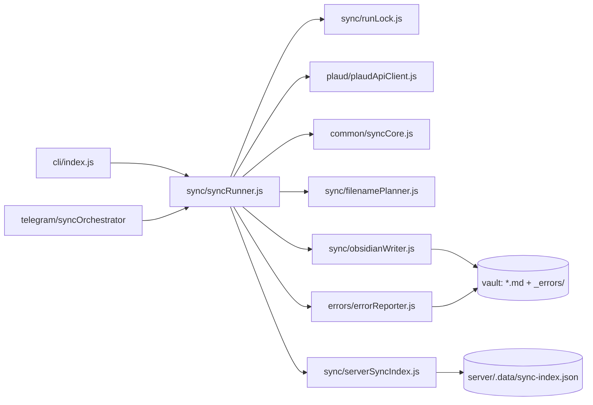

# Архитектура Plaud Server Exporter

Один git-репозиторий, две среды выполнения (Node CLI + Chrome MV3), и небольшой набор общих чистых модулей. Цель документа — дать новому разработчику (или AI-агенту) карту кода за минуту: где что лежит, какие файлы общие, и что трогать при изменении X.

## Карта репозитория

```
plaud-server-exporter/
├── server/                      Node CLI + Telegram bot
│   ├── src/
│   │   ├── cli/                 Точка входа: auth | sync | status | bot | logout
│   │   ├── config/              dotenv + getters (singleton)
│   │   ├── auth/                Playwright login, session.json snapshot
│   │   ├── plaud/               Plaud HTTP API + folders/tags
│   │   ├── sync/                Цикл экспорта, индекс, lock, filename planner, writer
│   │   ├── errors/              Классификация ошибок + report в _errors/
│   │   ├── telegram/            Бот: loop, handlers, копии UI, дерево, scheduler
│   │   ├── security/            redact для логов и отчётов
│   │   └── logger.js
│   └── tests/                   node:test (см. ниже)
├── plaud-exporter/              Chrome MV3 extension
│   ├── common/                  ОБЩИЕ модули с server (см. ниже)
│   ├── features/audioExport/    Plaud API client + smart sync (browser)
│   ├── background.js            Service worker (downloads, оркестрация)
│   ├── content.js               Бутстрап в plaud.ai
│   └── popup/                   UI расширения
├── docs/                        Документация (RU)
├── deploy/                      systemd, logrotate
└── scripts/                     verify-submodule.js, server-as-plaud.sh
```

## Общий код (shared common)

Три файла — единственный формальный контракт между server и extension. Меняешь один — обновляешь оба consumer'а и оба набора тестов. Список зафиксирован в [`scripts/verify-submodule.js`](../scripts/verify-submodule.js) (`REQUIRED_SUBMODULE_FILES`).

| Файл | Что в нём | Server-side consumers |
|------|-----------|------------------------|
| [`plaud-exporter/common/syncCore.js`](../plaud-exporter/common/syncCore.js) | Стабильные ID, хеши саммари, `determineSyncAction` (new / unchanged / metadata-only / re-download), нормализация индекса | `syncRunner.js`, `serverSyncIndex.js`, `errorReporter.js` |
| [`plaud-exporter/common/exportPathUtils.js`](../plaud-exporter/common/exportPathUtils.js) | Санитизация имён, даты-префиксы, `MAX_FULL_PATH_LENGTH`, режимы экспорта | `filenamePlanner.js`, `obsidianWriter.js` |
| [`plaud-exporter/common/plaudFolders.js`](../plaud-exporter/common/plaudFolders.js) | Парсинг filetags, `attachFolderSegmentsToFiles`, локализованный Unfiled, Trash | Re-export в `server/src/plaud/plaudFolders.js`; `recordingsApi.js`, `vaultTree.js`, `plaudLiveTree.js` |

> Исторически каталог называется «submodule» в скриптах (`npm run verify`, `scripts/verify-submodule.js`), но это **не git-submodule**. Это вендорный код в монорепо. Сценарий: импорты server'а резолвятся как `../../../plaud-exporter/common/...`.

Остальные модули `plaud-exporter/common/` (`storageUtils.js`, `domUtils.js`, `uiComponents.js`, `plaud-i18n-messages.js`, `plaudRecordingIds.js`) — **только** для расширения, server их не использует.

Команда `npm run verify` из корня проверяет, что все три файла существуют и что относительные импорты из `server/src/` резолвятся. CI запускает её на каждом push/PR.

## Точки входа

| Команда | Что запускается |
|---------|-----------------|
| `npm run server:auth` | [`server/src/cli/index.js`](../server/src/cli/index.js) → Playwright (только Mac) → `server/.data/session.json` |
| `npm run server:sync` | CLI → [`server/src/sync/syncRunner.js`](../server/src/sync/syncRunner.js) |
| `npm run server:status` | CLI → JSON со статусом конфига и сессии |
| `npm run server:bot` | CLI → [`server/src/telegram/index.js`](../server/src/telegram/index.js) (long-poll + scheduler) |
| Chrome | manifest.json → `background.js` + `content.js` |

## Поток sync



1. CLI или Telegram-бот запускает `runSync`.
2. `runLock` берёт файловый лок (`server/.data/sync.lock`, `O_EXCL`).
3. Plaud API → список записей + саммари по каждой.
4. `syncCore.determineSyncAction` решает: new / unchanged / metadata-only update / content re-download.
5. `filenamePlanner` + `obsidianWriter` пишут `.md` атомарно; при metadata-only — `rename`/`move`.
6. `serverSyncIndex` сохраняет индекс (atomic + `.bak`).
7. Ошибки классифицируются и пишутся в `{vault}/_errors/*.md`.

## Состояние на диске

| Путь | Назначение |
|------|------------|
| `server/.data/session.json` | Plaud session (mode `0o600`) |
| `server/.data/sync-index.json` | Состояние sync (атомик + `.bak`) |
| `server/.data/status.json` | Последний run (для `server:status` и бота) |
| `server/.data/sync.lock` | Файловый лок |
| `server/.data/owner-chat.json` | Chat ID владельца бота |
| `server/.data/bot-settings.json` | Интервал автосинка |
| `server/.data/telegram-offset.json` | Offset long-poll |
| `server/.data/tree-browse.json` | Per-chat browse state для `pick-by-number` в Telegram (TTL 30 мин) |
| `{vault}/Plaud/...md` | Саммари |
| `{vault}/_errors/*.md` | Отчёты об ошибках |

Все JSON в `.data/` — `chmod 600`, директория `chmod 700`. См. [security.md](./security.md).

## Коды выхода CLI

| Код | Значение |
|-----|----------|
| `0` | Успех |
| `1` | Ошибки sync (см. `_errors/`) |
| `2` | Нет/битая сессия или нет `TELEGRAM_BOT_TOKEN` для `bot` |
| `3` | Изменился API Plaud (`PlaudChangedError`) |
| `4` | Уже идёт другой sync (lock занят) |

Telegram-бот собственного exit code не использует — `syncOrchestrator` никогда не пробрасывает ошибки, маппит их в HTML.

## Что трогать при изменении X

| Изменение | Файлы |
|-----------|-------|
| Новое поле в индексе sync | [`syncCore.js`](../plaud-exporter/common/syncCore.js) (decision + normalize), [`serverSyncIndex.js`](../server/src/sync/serverSyncIndex.js), тесты обоих пакетов |
| Логика имени файла / папки | [`exportPathUtils.js`](../plaud-exporter/common/exportPathUtils.js), [`filenamePlanner.js`](../server/src/sync/filenamePlanner.js), [`plaudFolders.js`](../server/src/plaud/plaudFolders.js) |
| Новый тип ошибки sync | [`errorClassifier.js`](../server/src/errors/errorClassifier.js), [`errorReporter.js`](../server/src/errors/errorReporter.js), README exit codes |
| Сообщения/кнопки Telegram | [`telegram/messages.js`](../server/src/telegram/messages.js), [`telegram/keyboards.js`](../server/src/telegram/keyboards.js) |
| Callback'и Telegram | `handlers.js` + кодек callback data (см. `messages.js` — `filesTreeFolderCallback`) |
| Новая команда CLI | [`server/src/cli/index.js`](../server/src/cli/index.js) |
| Env переменная | [`server/src/config/config.js`](../server/src/config/config.js) + [`.env.example`](../.env.example) + [`server/README.md`](../server/README.md) |
| Тесты sync flow | `server/tests/syncRunner*.test.js` |
| Тесты Telegram | `server/tests/telegram*.test.js`, `syncOrchestrator.test.js` |

## Локальная проверка

```bash
npm install --workspaces
cd plaud-exporter && npm install && cd ..

npm test                 # server (node:test)
npm run lint             # eslint server/
npm run verify           # shared common imports + файлы существуют
npm run test:submodule   # plaud-exporter (node:test)
```

CI ([`/.github/workflows/ci.yml`](../.github/workflows/ci.yml)) гоняет всё то же самое на Node 20 и 22 при push/PR в `main`.

## Что **не** трогаем в этом репо

- БД, очереди, HTTP API — нет и не планируем; всё на файлах.
- Скачивание аудио с сервера — намеренно отключено (`runSync` summary-only). Аудио — только через Chrome-расширение.
- Playwright на VPS — не запускать (1 GB RAM, нет дисплея); auth только на Mac.
- Два параллельных sync на одном vault на разных машинах — `runLock` локальный.

## История и связанные документы

- [`docs/server-exporter-research.md`](./server-exporter-research.md) — обоснование портирования расширения в серверный CLI.
- [`docs/stabilization-audit.md`](./stabilization-audit.md), [`docs/stabilization-result.md`](./stabilization-result.md) — аудит и результат стабилизации (май 2026).
- [`docs/getting-started.md`](./getting-started.md) — установка и первый запуск.
- [`docs/server-deploy.md`](./server-deploy.md) — продакшен-деплой на VPS.
