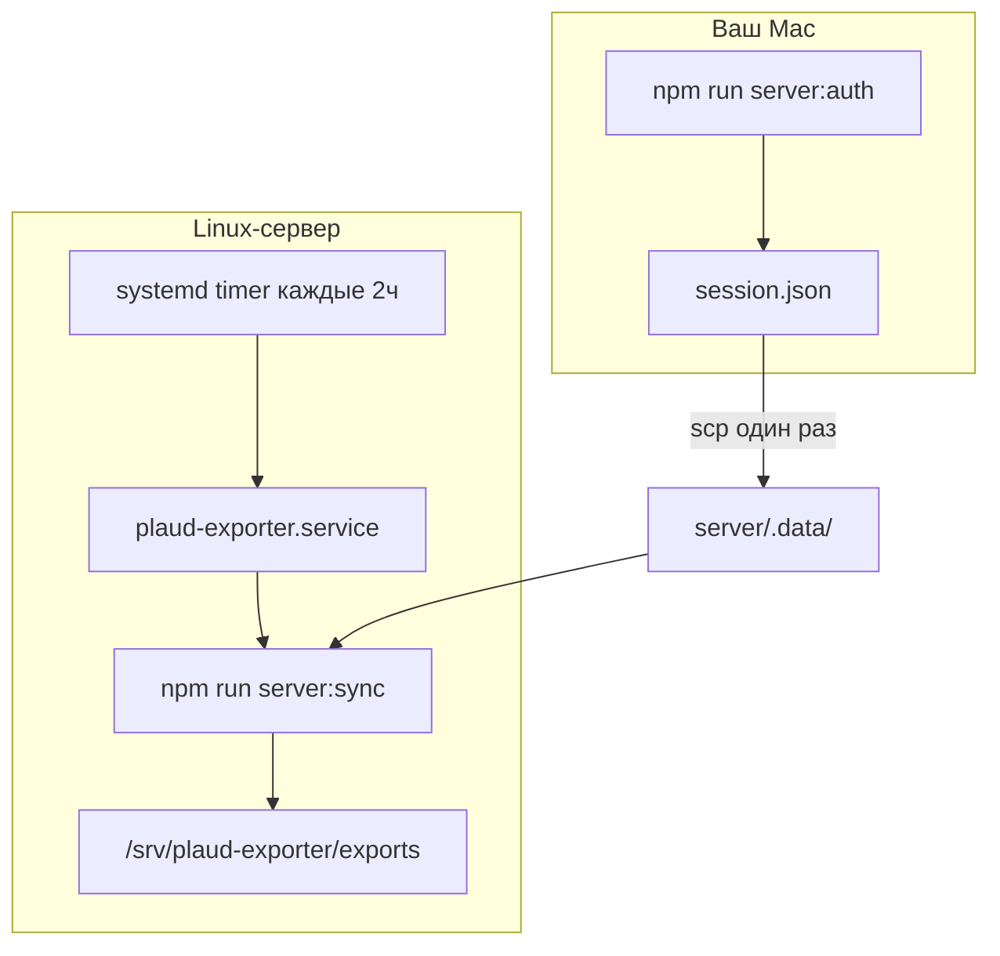

# Как запустить Plaud Server Exporter

Пошаговая инструкция для локальной проверки и для продакшн-сервера.  
Предполагается, что вы умеете открыть терминал, клонировать репозиторий и править текстовый файл.

## Что делает этот проект

**Plaud Server Exporter** — это консольная программа (CLI) на Node.js. Она:

1. Подключается к API Plaud (как веб-приложение Plaud в браузере).
2. Скачивает **саммари** ваших записей.
3. Сохраняет их в **Markdown** — удобно открывать в Obsidian.
4. Запоминает, что уже выгрузила, в файле `sync-index.json`, чтобы не дублировать файлы.

По умолчанию **аудио не качается** — только текст саммари. Аудио можно включить отдельно (см. ниже).

На сервере обычно ставят **таймер systemd**: раз в 2 часа программа сама запускает синхронизацию.  
Никакого веб-сервера, портов и Nginx для экспортера **не нужно**.

---

## Что понадобится

| Требование | Локально (Mac/Linux) | Сервер (Ubuntu) |
|------------|----------------------|-----------------|
| Node.js | **20 или новее** (`node -v`) | То же |
| Git | да | да |
| Аккаунт Plaud | да | да (тот же или импорт сессии) |
| Браузер Chromium | для первого входа (`server:auth`) | опционально; часто сессию копируют с Mac |

Проверка Node:

```bash
node -v   # должно быть v20.x.x или выше
npm -v
```

Если Node старый — установите LTS с [nodejs.org](https://nodejs.org/) или через `nvm`.

---

# Часть 1. Локальный запуск (для проверки)

Цель: убедиться, что код работает, логин проходит, файлы появляются в выбранной папке.

## Самый быстрый путь — кнопки play в IntelliJ IDEA

В репозитории лежит папка `.run/` с готовыми Run Configurations.
Откройте проект в IDEA и в правом верхнем углу в выпадающем списке конфигов
выберите нужную, нажмите зелёный треугольник (play).

Порядок для первого запуска:

| # | Конфигурация | Что делает |
|---|---|---|
| 01 | Install deps | `npm install --workspaces` |
| 02 | Install Playwright Chromium | ставит браузер для логина |
| 03 | Init env file | создаёт `.env` из примера (если ещё нет) — после этого откройте `.env` и выставьте `PLAUD_EXPORT_ROOT` и `PLAUD_TIMEZONE` |
| 04 | Status | показывает текущие настройки и состояние сессии |
| 05 | Plaud login (auth) | открывает Chromium, логин в Plaud, сохраняет сессию |
| 06 | Sync — DRY RUN | план без записи файлов (безопасно) |
| 07 | Sync — summaries | реальная выгрузка `.md` |
| 08 | Sync — with audio | выгрузка вместе с аудио |
| 09 | Refresh session (headless) | обновить сессию без UI (если профиль жив) |
| 10 | Logout (drop session) | удалить `session.json` |
| 11 | Tests | `npm test` |
| 12 | Lint | `npm run lint` |
| 13 | Verify submodule | `npm run verify` |

Дальше — то же самое руками в терминале, на случай если IDEA нет под рукой.

### Где выполнять команды

Все команды `npm …`, `cp .env.example`, `npx playwright` — из **корня** клона
(`plaud-server-exporter/`), там где лежат `package.json` и `.env.example`.
Папка `docs/` — только документация; оттуда `cp .env.example .env` не сработает.

Если вы уже в `docs/` или в другой подпапке:

```bash
cd "$(git rev-parse --show-toplevel)"
```

Проверка, что вы в нужном месте: `ls .env.example package.json` — оба файла должны быть видны.

## Шаг 1. Клонировать репозиторий с submodule

В проекте есть подмодуль `plaud-exporter` (общий код с Chrome-расширением). Без него `npm run verify` упадёт.

```bash
git clone --recurse-submodules https://github.com/<ваш-орг>/plaud-server-exporter.git
cd plaud-server-exporter
```

Если уже склонировали **без** submodule:

```bash
git submodule update --init --recursive
```

## Шаг 2. Установить зависимости

```bash
cd "$(git rev-parse --show-toplevel)"
npm install --workspaces
```

Должна появиться папка `node_modules` (и в `server/`).

## Шаг 3. Установить браузер для Playwright (один раз)

Команда `server:auth` открывает Chromium для входа в Plaud (из корня репозитория,
после `npm install`):

```bash
cd "$(git rev-parse --show-toplevel)"
npx playwright install chromium
```

Без этого шага `npm run server:auth` может завершиться ошибкой про отсутствующий браузер.

## Шаг 4. Настроить `.env`

Скопируйте пример и отредактируйте (файл `.env.example` — в корне, не в `docs/`):

```bash
cd "$(git rev-parse --show-toplevel)"
cp .env.example .env
```

Минимум для локальной проверки:

```env
# Куда складывать выгрузку (создайте папку заранее или программа попытается писать туда)
PLAUD_EXPORT_ROOT=/Users/ваш-юзер/plaud-test-exports

# Часовой пояс для имён файлов и дат в путях
PLAUD_TIMEZONE=Europe/Moscow

# По умолчанию — только саммари, без аудио (можно не трогать)
PLAUD_EXPORT_SUMMARY_ONLY=true
PLAUD_EXPORT_AUDIO=false
```

**Важно:** файл `.env` в git не коммитится. Там нет паролей Plaud — пароль вводится только в браузере при `server:auth`. В `.env` только пути и настройки поведения.

Опционально — писать сразу в папку Obsidian:

```env
PLAUD_OBSIDIAN_VAULT_PATH=/Users/ваш-юзер/Documents/MyVault
PLAUD_OBSIDIAN_SUBFOLDER=Plaud
```

Тогда файлы появятся в `MyVault/Plaud/2026/...`, а не в `PLAUD_EXPORT_ROOT`.

## Шаг 5. Первый вход в Plaud (`server:auth`)

```bash
npm run server:auth
```

Что произойдёт:

1. Откроется окно Chromium.
2. Войдите в Plaud так же, как в обычном браузере (email, пароль, 2FA если есть).
3. Дождитесь, пока откроется рабочий интерфейс Plaud.
4. Терминал напишет, что сессия сохранена.

Сессия лежит здесь (не коммитьте в git):

```
server/.data/session.json
```

Также создаётся профиль браузера в `server/.data/playwright-profile/` — для обновления сессии без полного логина.

**Повторный вход / сессия протухла:**

```bash
npm run server:auth
# или обновление без UI (если профиль ещё живой):
npm run server:auth -- --refresh
```

## Шаг 6. Проверить конфигурацию

```bash
npm run server:status
```

Смотрите в выводе:

- `session.present: true` — сессия на месте.
- `config.exportRoot` / vault — путь, куда пойдут файлы.
- `config.exportSummaryOnly` / `exportAudio` — что реально включено.

Если `session.present: false` — вернитесь к шагу 5.

## Шаг 7. «Сухой» прогон (ничего не пишет на диск)

```bash
npm run server:sync -- --dry-run
```

Программа:

- сходит в API Plaud;
- покажет, сколько записей нашла и что **собиралась** бы записать;
- **не создаёт** `.md`, не трогает `sync-index.json`.

Код выхода `0` — хорошо. Код `2` — проблема с авторизацией (снова `server:auth`).

## Шаг 8. Реальная синхронизация

```bash
npm run server:sync
```

После успеха проверьте папку из `.env`:

```text
{PLAUD_EXPORT_ROOT или vault}/Plaud/
└── 2026/
    └── 2026-05-18 - Название встречи.md
```

И служебные файлы (не трогайте руками без причины):

| Файл | Зачем |
|------|--------|
| `server/.data/sync-index.json` | Что уже выгружено |
| `server/.data/status.json` | Статистика последнего запуска |
| `{vault}/_errors/*.md` | Отчёты об ошибках (если были) |

## Шаг 9. (Опционально) Аудио за один раз

```bash
npm run server:sync -- --audio-too
```

Файлы аудио появятся в `Plaud/_attachments/`. Это тяжелее по трафику и диску — для проверки обычно достаточно шага 8 без аудио.

## Шаг 10. (Опционально) Тесты разработчика

Проверка, что ничего не сломано в коде:

```bash
npm test
npm run verify
npm run lint
```

Тесты **не** ходят в реальный Plaud API (используются моки).

---

## Шпаргалка команд (локально)

| Команда | Что делает |
|---------|------------|
| `npm run server:auth` | Войти в Plaud, сохранить сессию |
| `npm run server:status` | Показать настройки и состояние |
| `npm run server:sync -- --dry-run` | План без записи файлов |
| `npm run server:sync` | Выгрузить саммари |
| `npm run server:sync -- --audio-too` | Саммари + аудио |
| `node server/src/cli/index.js logout` | Удалить `session.json` |

### Коды выхода (exit code)

| Код | Значение | Что делать |
|-----|----------|------------|
| 0 | Успех | — |
| 1 | Ошибки по отдельным файлам / сеть | Смотреть `_errors/`, логи |
| 2 | Авторизация | `npm run server:auth` |
| 3 | Plaud изменил API (`plaud_changed`) | См. [troubleshooting.md](./troubleshooting.md) |
| 4 | Уже идёт другой `sync` | Подождать или проверить `sync.lock` |

---

# Часть 2. Запуск на сервере (Ubuntu)

Цель: программа крутится под отдельным пользователем, раз в 2 часа сама синхронизирует записи, логи пишутся в `/var/log/plaud-exporter/`.

Подробности также в [server-deploy.md](./server-deploy.md) (на английском).

## Общая схема



## Шаг 1. Node.js 20+ на сервере

```bash
sudo apt update
sudo apt install -y git
node -v
```

Если версия ниже 20:

```bash
curl -fsSL https://deb.nodesource.com/setup_20.x | sudo -E bash -
sudo apt install -y nodejs
```

## Шаг 2. Системный пользователь и логи

```bash
sudo useradd --system --create-home --home-dir /srv/plaud-exporter --shell /usr/sbin/nologin plaud
sudo mkdir -p /var/log/plaud-exporter
sudo chown -R plaud:plaud /var/log/plaud-exporter
sudo chmod 0750 /var/log/plaud-exporter
```

Пользователь `plaud` не может интерактивно залогиниться по SSH — это нормально. Все команды ниже — от root с `sudo -u plaud`.

## Шаг 3. Клонировать проект от имени `plaud`

```bash
sudo -u plaud git clone https://github.com/<ваш-орг>/plaud-server-exporter.git /srv/plaud-exporter
cd /srv/plaud-exporter
sudo -u plaud git submodule update --init --recursive
sudo -u plaud npm install --workspaces
```

Playwright на сервере **часто не нужен**, если сессию перенесёте с Mac (шаг 5). Если всё же будете делать `server:auth` на сервере:

```bash
sudo -u plaud npx playwright install chromium
```

## Шаг 4. Настроить `.env` на сервере

```bash
cd /srv/plaud-exporter
sudo -u plaud cp .env.example .env
sudo -u plaud chmod 600 .env
sudo -u plaud nano .env   # или vim
```

Пример для сервера:

```env
PLAUD_EXPORT_ROOT=/srv/plaud-exporter/exports
PLAUD_TIMEZONE=Europe/Moscow
PLAUD_EXPORT_SUMMARY_ONLY=true
PLAUD_EXPORT_AUDIO=false
PLAUD_LOG_LEVEL=info
```

Создайте каталог выгрузки:

```bash
sudo -u plaud mkdir -p /srv/plaud-exporter/exports
```

Если Obsidian на сервере синхронизируется (Syncthing и т.д.), укажите `PLAUD_OBSIDIAN_VAULT_PATH` — см. [obsidian-sync.md](./obsidian-sync.md).

## Шаг 5. Авторизация на сервере (выберите один способ)

### Способ A — рекомендуется: логин на Mac, копирование сессии

На **Mac** (где есть дисплей):

```bash
cd plaud-server-exporter
npm run server:auth
```

Скопировать на сервер (путь подставьте свой):

```bash
scp server/.data/session.json user@your-server:/tmp/session.json
ssh user@your-server 'sudo mkdir -p /srv/plaud-exporter/server/.data && sudo mv /tmp/session.json /srv/plaud-exporter/server/.data/session.json && sudo chown plaud:plaud /srv/plaud-exporter/server/.data/session.json && sudo chmod 600 /srv/plaud-exporter/server/.data/session.json'
```

### Способ B — импорт из DevTools (без браузера на сервере)

1. На Mac в Chrome: войти на https://web.plaud.ai  
2. Собрать JSON по инструкции [devtools-data-needed.md](./devtools-data-needed.md)  
3. На сервере:

```bash
sudo -u plaud npm run server:auth -- --import /path/to/plaud-session.json
```

### Способ C — X11 forwarding (редко)

```bash
ssh -X user@server
cd /srv/plaud-exporter
npm run server:auth
```

### Проверка после любого способа

```bash
sudo -u plaud npm run server:status
sudo -u plaud npm run server:sync -- --dry-run
```

Должны быть `session.present: true` и список записей без ошибки auth.

## Шаг 6. Установить systemd (автозапуск по таймеру)

Скопировать unit-файлы из репозитория:

```bash
sudo cp /srv/plaud-exporter/deploy/systemd/plaud-exporter.service /etc/systemd/system/
sudo cp /srv/plaud-exporter/deploy/systemd/plaud-exporter.timer  /etc/systemd/system/
sudo systemctl daemon-reload
sudo systemctl enable --now plaud-exporter.timer
```

Проверка:

```bash
systemctl list-timers plaud-exporter.timer
systemctl status plaud-exporter.timer
```

Ручной запуск один раз (не дожидаясь таймера):

```bash
sudo systemctl start plaud-exporter.service
sudo journalctl -u plaud-exporter.service -n 50 --no-pager
```

Логи синхронизации также пишутся в:

```text
/var/log/plaud-exporter/sync.log
```

Таймер по умолчанию: **каждые 2 часа** (+ случайная задержка до 5 минут), первый запуск через 10 минут после загрузки.

## Шаг 7. Ротация логов (рекомендуется)

```bash
sudo cp /srv/plaud-exporter/deploy/logrotate/plaud-exporter /etc/logrotate.d/plaud-exporter
sudo logrotate -d /etc/logrotate.d/plaud-exporter
```

## Шаг 8. Обновление кода на сервере

```bash
cd /srv/plaud-exporter
sudo -u plaud git pull
sudo -u plaud git submodule update --init --recursive
sudo -u plaud npm install --workspaces
# при изменении unit-файлов:
sudo cp deploy/systemd/plaud-exporter.* /etc/systemd/system/
sudo systemctl daemon-reload
```

После обновления — тестовый прогон:

```bash
sudo -u plaud npm run server:sync -- --dry-run
```

---

## Частые проблемы (кратко)

### `cp: .env.example: No such file or directory`

Вы не в корне репозитория (часто — в `docs/`). Выполните
`cd "$(git rev-parse --show-toplevel)"` и повторите `cp .env.example .env`.

### `session.present: false` или exit code 2

Сессия истекла или не скопирована. Снова `server:auth` на Mac и `scp`, либо `--import`.

### Файлы не появляются

1. `npm run server:status` — правильный ли путь `exportRoot` / vault?  
2. Права: каталог должен быть доступен пользователю, под которым идёт sync (`plaud` на сервере).  
3. Смотрите `{vault}/_errors/`.

### На сервере sync падает, локально работает

- Сравните `.env` (часовой пояс, пути).  
- Убедитесь, что `session.json` принадлежит `plaud:plaud` и mode `600`.  
- Читайте `/var/log/plaud-exporter/sync.log`.

### Exit code 4 — «sync already running»

Другой процесс уже держит lock. На сервере не запускайте вручную `server:sync` одновременно с systemd. Подробнее: [troubleshooting.md](./troubleshooting.md).

### Безопасность

Токены лежат в `server/.data/session.json`. Не коммитьте, не скидывайте в чаты. Ротация и компрометация: [security.md](./security.md).

---

## Чеклист для джуна

**Локально** (все команды — из корня репозитория, не из `docs/`)

- [ ] `node -v` ≥ 20  
- [ ] `git submodule update --init --recursive`  
- [ ] `npm install --workspaces`  
- [ ] `npx playwright install chromium`  
- [ ] `cp .env.example .env` и правки `PLAUD_EXPORT_ROOT`, `PLAUD_TIMEZONE`  
- [ ] `npm run server:auth` → `session.present: true`  
- [ ] `npm run server:sync -- --dry-run` → exit 0  
- [ ] `npm run server:sync` → появился `.md` в `Plaud/YYYY/`  

**Сервер**

- [ ] пользователь `plaud`, каталоги `/srv/plaud-exporter`, `/var/log/plaud-exporter`  
- [ ] репозиторий + submodule + `npm install`  
- [ ] `.env` chmod 600, сессия на месте  
- [ ] `dry-run` от `sudo -u plaud` успешен  
- [ ] timer enabled, в логе есть успешный run  

---

## Дополнительная документация (англ.)

| Документ | Тема |
|----------|------|
| [../README.md](../README.md) | Обзор проекта |
| [server-deploy.md](./server-deploy.md) | Деплой Ubuntu / systemd |
| [troubleshooting.md](./troubleshooting.md) | Ошибки и решения |
| [security.md](./security.md) | Секреты и ротация |
| [obsidian-sync.md](./obsidian-sync.md) | Syncthing / Git для vault |
| [devtools-data-needed.md](./devtools-data-needed.md) | Импорт сессии без Playwright |
