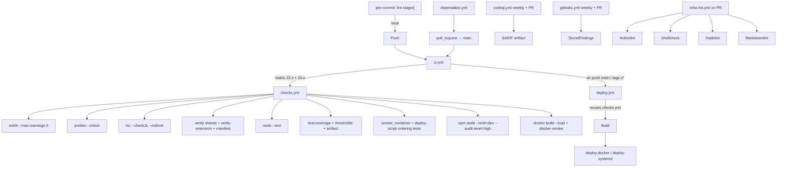

# Quality Gate

Документ описывает, как устроен текущий quality gate и какие проверки должны быть обязательными в branch protection
main.

## Источники правды

- **Локально / в CI**: один и тот же набор шагов запускается через `npm run check` и через reusable workflow
  `.github/workflows/checks.yml`.
- **Pre-commit (опционально, ставится `npm install` через `prepare`)**: `simple-git-hooks` + `lint-staged` запускают
  prettier/eslint/manifest verify на изменённые файлы. Конфиг лежит в [.lintstagedrc.mjs](../.lintstagedrc.mjs); ESLint
  диспатчится по воркспейсам через [scripts/lint-staged-eslint.mjs](../scripts/lint-staged-eslint.mjs), потому что
  флэт-конфиг ESLint находится внутри `server/` и `browser-extension/`, а не в корне.
- **PR template**: [.github/PULL_REQUEST_TEMPLATE.md](../.github/PULL_REQUEST_TEMPLATE.md) — короткий чек-лист.
- **CODEOWNERS**: [.github/CODEOWNERS](../.github/CODEOWNERS) — авто-reviewer на shared/CI/деплой пути.

## Layout: что запускается и когда



## Required status checks (branch protection main)

Поставить как **Required** в Branch Protection Rules:

| Check name (GitHub UI)                                     | Source                             |
| ---------------------------------------------------------- | ---------------------------------- |
| `CI / Checks (Node 22.x) / Lint, verify, test (Node 22.x)` | `.github/workflows/ci.yml` matrix  |
| `CI / Checks (Node 24.x) / Lint, verify, test (Node 24.x)` | `.github/workflows/ci.yml` matrix  |
| `Infra lint / actionlint (workflows)`                      | `.github/workflows/infra-lint.yml` |
| `Infra lint / shellcheck (scripts/, deploy/)`              | `.github/workflows/infra-lint.yml` |
| `Infra lint / hadolint (Dockerfile)`                       | `.github/workflows/infra-lint.yml` |
| `Infra lint / markdownlint (docs)`                         | `.github/workflows/infra-lint.yml` |
| `CodeQL / CodeQL JavaScript/TypeScript`                    | `.github/workflows/codeql.yml`     |
| `gitleaks / Secret scan`                                   | `.github/workflows/gitleaks.yml`   |

### CodeQL на приватном репозитории

Репозиторий **private**: загрузка SARIF в **Security → Code scanning** требует включённого code scanning и
[GitHub Advanced Security](https://docs.github.com/en/get-started/learning-about-github/about-github-advanced-security)
(GHAS). Без GHAS шаг `analyze` падает на upload с ошибкой «Code scanning is not enabled».

Workflow [`.github/workflows/codeql.yml`](../.github/workflows/codeql.yml) по умолчанию:

- выполняет полный CodeQL-анализ (`security-and-quality`);
- **не** шлёт SARIF в GitHub (`upload: never`);
- сохраняет SARIF как artifact **codeql-javascript-sarif** (скачать из run → Artifacts).

После включения GHAS и code scanning в настройках репозитория: в `codeql.yml` смените `upload` на `always`,
`wait-for-processing` на `true`, добавьте в job `security-events: write`.

Дополнительно включить:

- "Require branches to be up to date before merging" — гарантирует, что главный `checks.yml` запускается на свежем main.
- "Require linear history" — упрощает откаты.
- "Restrict who can push to matching branches" — никто, кроме CI и владельца.
- "Do not allow bypassing the above settings" — обязательно.

## Локальная команда воспроизводящая CI

```bash
npm install                # ставит deps + хук simple-git-hooks
npm run check              # = lint + lint:extension + typecheck + format:check
                           #   + lint:markdown + verify + verify:extension
                           #   + test + test:extension + smoke_container
```

Coverage по умолчанию выделена в отдельную команду (Node 22+):

```bash
npm run test:coverage      # требует Node 22+: lcov + thresholds в scripts/
```

Server-тесты всегда стартуют через `server/tests/testEnvironment.js`: рабочий `.env` не загружается, `.data` и export
root заменяются временными каталогами, а внешний `fetch` запрещён без явного тестового мока. Обычный и coverage-run
используют один preload.

Extension coverage проверяет два независимых scope:

- `common/`: 85% строк / 75% веток / 90% функций;
- критические background/content/audio-export workflow: 75% / 65% / 70%.

Для критических orchestrator/handler/download/session файлов одного высокого среднего недостаточно: каждый файл
обязан присутствовать в LCOV, иначе gate падает.

Готовый Docker smoke (требует Docker):

```bash
bash scripts/docker-smoke-image.sh plaud-exporter:smoke   # build + smoke run
```

## Ratchet plan

Гейт сознательно прагматичный, чтобы не ломать поток разработки. Параметры, которые планируется поднимать:

- `tsc --strictNullChecks: false` → `true` после прохода по сервису null-safety.
- `MD040`/`MD031`/`MD029` уже включены — далее можно подсветить ещё.
- Coverage thresholds в [scripts/coverage-thresholds.\*.json](../scripts/) могут расти по мере роста реального покрытия.
- `npm audit --audit-level=high` → `moderate`, как только подтянем оставшиеся patch-uplifts.
- `strictNullChecks` для extension остаётся выключенным, но текущий `checkJs` уже охватывает весь runtime:
  root entrypoints, `background/`, `content/`, `features/`, `popup/` и `common/`.

См. [AGENTS.md](../AGENTS.md) для карты репозитория и команд.
