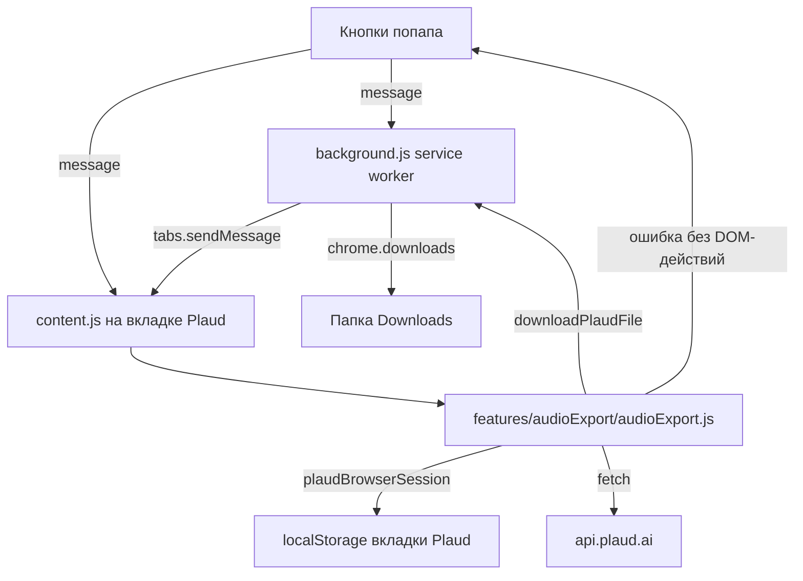
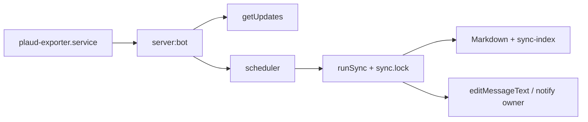

# Исследование Plaud Server Exporter

> Справочник для разработки. Инструкция по эксплуатации: [getting-started.md](./getting-started.md).

## Резюме

Server exporter переносит рабочую логику Chrome-расширения
[`plaud-exporter`](../browser-extension/README.md) (Manifest V3) в headless Node.js:
скачивание записей и AI-саммари Plaud на сервере, запись Markdown для Obsidian и
пропуск неизменённого — без открытия попапа в браузере каждый раз.

Расширение для основных данных не обходит DOM Plaud. Оно читает несколько ключей
`localStorage`, вызывает внутренние HTTPS-эндпоинты под `*.plaud.ai` и ведёт
дедуплицирующий индекс sync. Почти всё переносимо на сервер. Браузерно-специфично:
(1) чтение `localStorage` для JWT/workspace, (2) `chrome.downloads` для записи
файлов. При сбое API расширение завершается без DOM-автоматизации, чтобы не
изменять записи пользователя.

Рекомендуется **гибридная** архитектура: прямой внутренний API-клиент для
обычного sync и Playwright только для однократного входа или обновления снимка
сессии.

## Архитектура расширения

Manifest V3, три слоя runtime.

| Слой           | Файлы                                  | Задача                                                                                                             |
| -------------- | -------------------------------------- | ------------------------------------------------------------------------------------------------------------------ |
| Service worker | `background.js`, `background/*`        | Уведомления, оркестрация; `chromeDownloadBridge.js` — `chrome.downloads`; `tabMessaging.js` — сообщения во вкладку |
| Content script | `content.js`, `features/audioExport/*` | На `web.plaud.ai` / `app.plaud.ai`; `plaudBrowserSession.js` — `localStorage`; API и smart sync в `audioExport.js` |
| Popup          | `popup/*`                              | Запуск экспорта, настройка подпапки sync                                                                           |

Протокол сообщений между слоями: константы `action` в
[`runtimeMessages.js`](../browser-extension/common/runtimeMessages.js) (SW и
`audioExport` импортируют ESM; popup/content — строковые литералы, сверка
тестом).

Чистая логика — stable id, решения sync, имена, папки Plaud — в модулях без
браузера (shared с server):

- [`syncCore.js`](../browser-extension/common/syncCore.js)
- [`exportPathUtils.js`](../browser-extension/common/exportPathUtils.js)
- [`plaudFolders.js`](../browser-extension/common/plaudFolders.js)

Сервер импортирует их из `browser-extension/common/` — единый источник правды с
расширением (`npm run verify`).

## Текущий поток экспорта



`runSmartSync` в [`audioExport.js`](../browser-extension/features/audioExport/audioExport.js)
— ближайший аналог server sync:

1. Индекс из `chrome.storage.local`.
2. Список записей через внутренний API.
3. На запись: саммари, stable id, hash, решение `new` / `updated` /
   `already_synced` / `skipped`, запись только при необходимости.

Сервер заменяет (1) JSON-файлом, (3) — `fs.writeFile`, логику решений берёт из
`browser-extension/common/*` без изменений.

## Модель auth / сессии

Расширение **не** читает cookies в коде. Сессия — из `localStorage` вкладки Plaud.

| Ключ (`localStorage` Plaud Web)      | Назначение                                       |
| ------------------------------------ | ------------------------------------------------ |
| `pld_tokenstr` (или `tokenstr`)      | JWT пользователя                                 |
| claim `sub` в JWT                    | `userId` для других ключей                       |
| `pld_{userId}:currentWorkspaceId`    | активный workspace → заголовок `workspace-id`    |
| `pld_{userId}:workspaceList`         | `[{ workspaceId, workspaceToken, expiresAt }]`   |
| `pld_{userId}:plaud_user_api_domain` | API-хост пользователя (должен быть `*.plaud.ai`) |
| `plaud_user_api_domain`              | глобальный fallback                              |
| `pld_{userId}_{workspaceId}:sort_by` | сортировка списка, по умолчанию `start_time`     |

`getPlaudSession()` выставляет `Authorization`: **workspaceToken**, если не истёк,
иначе userToken, с префиксом `Bearer`. Заголовки запросов:

```text
Authorization: Bearer …
edit-from: web
app-platform: web
Content-Type: application/json
workspace-id: <workspaceId>      (если есть)
file-id: <id>                    (только на /ai/query_note)
```

Явного refresh в расширении нет — Plaud Web обновляет `localStorage`, пока вкладка
открыта. Повторы: сеть, 429, 5xx; 401/403 не повторяются.

## Внутренний API Plaud

База: `session.apiBase` (по умолчанию `https://api.plaud.ai`, переопределение через
`plaud_user_api_domain`, проверка `*.plaud.ai`).

| Метод | Путь                              | Назначение                  | Доп. заголовки |
| ----- | --------------------------------- | --------------------------- | -------------- |
| GET   | `/file/simple/web?…`              | Пагинированный список       | —              |
| GET   | `/filetag/` (fallback `/filetag`) | Виртуальные папки/теги      | —              |
| GET   | `/file/temp-url/{fileId}`         | Presigned URL аудио         | —              |
| GET   | `/ai/query_note`                  | Заметки саммари             | `file-id`      |
| GET   | `<note.data_link>`                | Тело markdown (внешний URL) | без auth Plaud |

Дополнительно:

- **Редирект региона:** `status === -302`, `data.domains.api` — смена `apiBase` и один
  повтор.
- **Backoff:** до 3 попыток, 500 ms → 8 s; таймауты, 429, 502–504, сеть; не 401/403.
- **Таймаут запроса:** 45 с, `AbortController`.

Идентификаторы записи в строке `/file/simple/web`: `file_id`, `fileId`, `id`,
`recording_id`, … `uuid`. Заголовки: `file_name`, `filename`, `title`, …

## Гипотеза срока жизни токена

Структурированный сигнал — `workspaceList[*].expiresAt` (секунды или мс, `<1e12` →
секунды). Истёкший workspace → user JWT. Срок user JWT в коде расширения не
отслеживается; 401/403 без retry → практически только re-auth на Plaud Web. На
сервере: `server:auth` или свежий импорт DevTools.

Политика для сервера:

- workspace token, пока `expiresAt` в будущем, иначе user token (как в расширении);
- любой 401/403 → `auth_expired`, без retry, явно в `server:status`;
- опционально (фаза 2): `server:auth --refresh` headless по профилю Playwright.

## Что переиспользовать на сервере

Из `browser-extension/common/` напрямую (см. `npm run verify`):

- `syncCore.js` — stable id, отпечатки, `folderSegment`, решения sync
  (в т.ч. `metadata_only` при смене папки/имени без нового хеша), нормализация
  индекса, пути артефактов.
- `exportPathUtils.js` — безопасные имена, заголовки из markdown.
- `plaudFolders.js` — filetags Plaud, Unfiled/Trash, `attachFolderSegmentsToFiles`.

Портировать в `server/src/plaud/` один в один по смыслу:

- `getPlaudSession` (из снимка, не `localStorage`);
- `buildPlaudHeaders`, `fetchPlaudApi`, retry, `-302`;
- `fetchPlaudFilesFromApi`, саммари, аудио URL, нормализация записей, sync-кандидаты.

## Что нельзя использовать напрямую

- `getPlaudSession()` — нет `localStorage` в Node; JSON-снимок Playwright/DevTools.
- `chrome.*` / data-URL → `node:fs/promises`.
- `mergeDomRecordingIdsIntoFiles`, `mergeLocalStorageRecordingIdsIntoFiles` — живая
  вкладка; на сервере только JSON API (фаза 2 — скан ключей снимка).
- `runDomExportFallback` — только браузер.
- Маршрутизация popup/background.

## Риски

| Риск                                     | Вероятность        | Смягчение                                                 |
| ---------------------------------------- | ------------------ | --------------------------------------------------------- |
| Неожиданное истечение JWT                | Средняя            | `server:auth`, `auth_expired` в status, без retry 401/403 |
| Смена полей/кодов Plaud                  | Низкая/средняя     | Версионированный клиент; диагностика статусов без тел     |
| Список API короче DOM-merge              | Низкая             | Лог расхождения; фаза 2 — теги и скан снимка              |
| Headless без UI для login                | Высокая при деплое | X11, auth на Mac + scp, `--import` DevTools               |
| Утечка секретов в логах                  | Средняя            | Центральная редакция; запрет печати токенов               |
| Расхождение с `browser-extension/common` | Низкая             | `npm run verify`                                          |

## Рекомендуемый путь реализации

**Вариант C — гибрид:**

1. **Playwright (редко).** `server:auth`: Chromium, `https://web.plaud.ai`, вход,
   проверка `GET /file/simple/web?limit=1`, снимок в `session.json` (`0600`).
2. **Прямой API.** `server:sync`: снимок → те же заголовки, что в расширении,
   четыре эндпоинта, `syncCore` + `exportPathUtils` из `browser-extension/common/`.
3. **Индекс.** `sync-index.json` — схема `plaudExporterSyncIndexV1`, те же
   `determineSyncAction`.
4. **Вывод.** `{vault}/Plaud/{YYYY-MM-DD} - {title}.md`; аудио опционально в
   `_attachments/`.
5. **Refresh.** При 401/403 — остановка, пометка снимка устаревшим, подсказка
   `server:auth`.

Быстрый путь совпадает с расширением (чистый HTTP); браузер — только при смене
сессии Plaud.

## Telegram-бот (эксплуатация)

На VPS вместо systemd timer — один процесс `server:bot` (`server/src/telegram/`):

| Модуль                | Назначение                                                       |
| --------------------- | ---------------------------------------------------------------- |
| `bot.js`              | Long-polling, маршрутизация updates                              |
| `handlers.js`         | Команды `/start`, `/menu`, `/status`, inline-кнопки              |
| `scheduler.js`        | Таймер автосинка (`BOT_SYNC_INTERVAL_MIN` / `bot-settings.json`) |
| `syncOrchestrator.js` | Общий lock и отчёты в чат (тот же `runSync`, что CLI)            |
| `ownerChat.js`        | Персистентный `chat_id` после первого `/start`                   |
| `auth.js`             | Gate по `TELEGRAM_ALLOWED_USERNAME`                              |

Поток:



Ручной `server:sync` и oneshot `plaud-exporter-sync.service` остаются для отладки;
параллельный запуск с ботом даёт код выхода `4` из-за `sync.lock`.

Инструкции: [getting-started.md](./getting-started.md), [server-deploy.md](./server-deploy.md).
