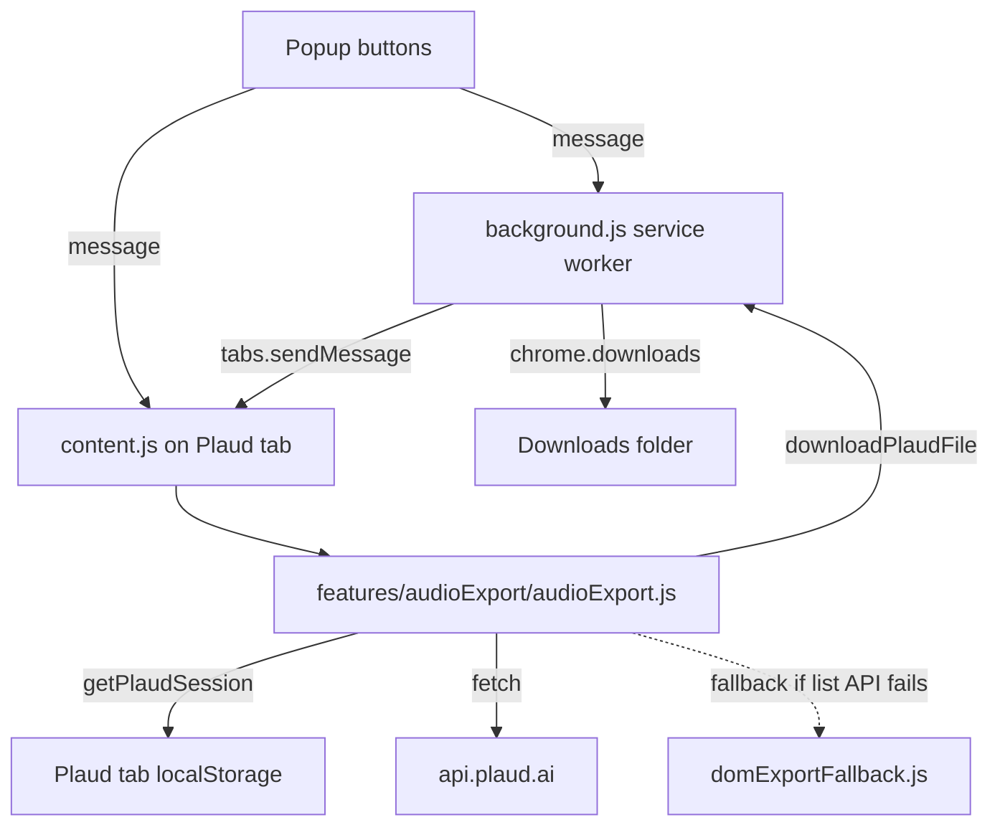

# Plaud Server Exporter Research

## Summary

This server exporter ports the working logic of the existing
[`plaud-exporter`](../plaud-exporter/README.md) Chrome extension (Manifest V3)
into a headless Node.js runtime. The goal is to download Plaud.ai recordings
and AI summaries on a server, write Obsidian-friendly Markdown, and avoid
re-downloading unchanged items — without the user having to open a browser
popup every time.

The extension does not browse the Plaud DOM for primary data. It reads a small
set of `localStorage` keys, calls a handful of internal HTTPS endpoints under
`*.plaud.ai`, and persists a deduplicating sync index. Almost all of that
behavior is portable to a server. The remaining browser-specific pieces are:
(1) reading `localStorage` for the JWT/workspace tokens, (2) using
`chrome.downloads` to write files, and (3) a DOM click fallback used only when
the JSON list endpoint fails.

We therefore recommend a **Hybrid** architecture: a direct internal API client
for every regular sync, and Playwright only when we need a one-time login or a
refresh of the session snapshot.

## Existing extension architecture

The extension is Manifest V3 with three runtime layers.

| Layer | Files | Responsibility |
|-------|-------|----------------|
| Service worker | `background.js` | Notifications, `chrome.downloads`, message routing, background sync runner |
| Content script | `content.js`, `features/audioExport/*` | Runs on `web.plaud.ai`/`app.plaud.ai`, reads `localStorage`, calls Plaud API, parses summaries |
| Popup UI | `popup/*` | Triggers exports, configures sync subfolder |

The relevant pure logic — stable IDs, sync action decisions, filenames, title
extraction — already lives in two browser-agnostic modules:

- [`plaud-exporter/common/syncCore.js`](../plaud-exporter/common/syncCore.js)
- [`plaud-exporter/common/exportPathUtils.js`](../plaud-exporter/common/exportPathUtils.js)

The server consumes these directly via a git submodule, so the extension and
the server share one source of truth.

## Current export flow



`runSmartSync` ([`features/audioExport/audioExport.js`](../plaud-exporter/features/audioExport/audioExport.js))
is the closest existing analogue to what the server needs. It:

1. Loads the sync index from `chrome.storage.local`.
2. Lists recordings via the internal API.
3. For each recording, fetches summary notes, computes a stable id and
   summary/audio hashes, decides `new` / `updated` / `already_synced` /
   `skipped`, and writes only when needed.

The server replaces (1) with a JSON file and (3)'s download calls with
`fs.writeFile`, but reuses the decision logic verbatim.

## Auth/session model

The extension does **not** read any cookies in code. The full session is
recovered from `localStorage` on the Plaud tab.

| Key (Plaud Web `localStorage`) | Purpose | Notes |
|--------------------------------|---------|-------|
| `pld_tokenstr` (or `tokenstr`) | User JWT | Base auth |
| JWT `sub` claim | `userId` | Used to build other keys |
| `pld_{userId}:currentWorkspaceId` | Active workspace | Used for `workspace-id` header |
| `pld_{userId}:workspaceList` | `[{ workspaceId, workspaceToken, expiresAt }]` | Workspace JWT; preferred over user JWT |
| `pld_{userId}:plaud_user_api_domain` | Per-user API host | Must end with `.plaud.ai` |
| `plaud_user_api_domain` | Global API host fallback | |
| `pld_{userId}_{workspaceId}:sort_by` | List sort field | Defaults to `start_time` |

`getPlaudSession()` builds the effective `Authorization` header as
**workspaceToken if not expired, else userToken**, with `Bearer ` prepended.
Headers used on every internal request:

```
Authorization: Bearer …
edit-from: web
app-platform: web
Content-Type: application/json
workspace-id: <workspaceId>      (if set)
file-id: <id>                    (only on /ai/query_note)
```

There is **no explicit refresh** in the extension. It relies on Plaud Web
itself to keep `localStorage` current while the tab is open. Retries are
limited to network errors, 429, and 5xx; `401`/`403` are deliberately not
retried.

## Plaud internal API findings

All endpoints are relative to `session.apiBase` (default
`https://api.plaud.ai`, can be overridden per-user via the `plaud_user_api_domain`
keys; sanity-checked to `*.plaud.ai`).

| Method | Path | Used for | Extra headers |
|--------|------|----------|---------------|
| GET | `/file/simple/web?skip&limit&sort_by&is_desc&r&is_trash&…` | Paginated recording list (with `is_trash` and per-tag/folder variants) | – |
| GET | `/filetag/` (with `/filetag` fallback) | Virtual folders/tags | None (called with user and workspace tokens, merged by id) |
| GET | `/file/temp-url/{fileId}` | Presigned audio URL + readable title hints | – |
| GET | `/ai/query_note` | Summary notes (`summary`, `auto_sum_note`, `sum_multi_note`) | `file-id: <id>` |
| GET | `<note.data_link>` (external presigned S3-like URL) | Markdown body of a summary | None (no Plaud auth) |

Three additional behaviors are worth porting:

- **Region redirect.** If the JSON body contains `status === -302` with
  `data.domains.api`, the client switches `apiBase` once and retries.
- **Backoff.** Up to 3 attempts with exponential delay (500ms → 8s) on
  timeouts, 429, 502–504, and generic network errors. 401/403 are not retried.
- **Per-request timeout.** 45 seconds with `AbortController`.

Recording identity comes from a small set of keys on each row of
`/file/simple/web`:

```
file_id, fileId, id, recording_id, recordingId,
audio_id, audioId, resource_id, resourceId, uuid
```

Titles are searched in `file_name`, `filename`, `fileName`, `file_title`,
`fileTitle`, `display_name`, `displayName`, `audio_name`, `recording_name`,
`recordingTitle`, `topic`, `name`, `title`.

## Token lifetime / refresh hypothesis

The extension treats workspace token expiry as the only structured signal:
`workspaceList[*].expiresAt`, interpreted as either seconds or milliseconds
(`<1e12` → seconds). If `expiresAt` is missing or in the past, the user JWT is
used.

User-token expiry is **not** observed anywhere in extension code. The fact
that 401/403 are not retried suggests the only practical recovery is to
re-authenticate on the Plaud Web page. On a server this means re-running
`server:auth` (Playwright) or re-importing a fresh DevTools snapshot.

A reasonable conservative policy for the server:

- Use the workspace token when `expiresAt` is in the future, else fall back to
  the user token (same logic as the extension).
- Treat any 401/403 as `auth_expired`; do not retry, surface clearly in
  `server:status`, and instruct the user to refresh.
- Optionally — phase 2 — let `server:auth --refresh` open the persistent
  Playwright profile headlessly, re-export the snapshot, and exit. The DOM
  is not parsed; we only need `localStorage` after the auto-login.

## What can be reused server-side

These modules from the extension submodule are pure JS without browser APIs
and are imported directly by the server:

- `common/syncCore.js` — stable ids, fingerprints, sync action decisions,
  index normalization, relative artifact paths.
- `common/exportPathUtils.js` — safe filename rules, title extraction from
  markdown.

These functions can be ported one-to-one into `server/src/plaud/`:

- `getPlaudSession` (read from snapshot instead of `localStorage`).
- `buildPlaudHeaders`, `fetchPlaudApi`, retry/backoff, `-302` switch.
- `fetchPlaudFilesFromApi` (in MVP we can start with `is_trash=0` +
  pagination; folder/tag variants are an optional second pass).
- `fetchPlaudSummaryExports`, `parseSummaryContent`, `findSummaryNotes`,
  `getNoteRawContent` (with the same external `data_link` fetch).
- `fetchPlaudAudioUrl`, `extractTitleForFileFromPayload`, `preferApiTitle`.
- `normalizePlaudFile`, `extractRawRecordingId`.
- `buildSyncCandidate`, `buildAudioSignature`, `buildSummaryBundle`.

## What cannot be reused directly

- `getPlaudSession()` itself — no `localStorage` in Node; replaced by a JSON
  snapshot produced by Playwright or DevTools import.
- `chrome.runtime`/`chrome.storage`/`chrome.downloads` paths and the
  data-URL trick — replaced by `node:fs/promises`.
- `mergeDomRecordingIdsIntoFiles` and `mergeLocalStorageRecordingIdsIntoFiles`
  — both depend on a live Plaud page. On the server we rely on the JSON API
  alone for the file list; the storage-key scan can be approximated against
  the saved snapshot in a phase 2 if pagination misses something.
- `runDomExportFallback` — DOM click loop, browser-only.
- Popup/background message routing.

## Risks

| Risk | Likelihood | Mitigation |
|------|------------|------------|
| User/workspace JWT expires unexpectedly | Medium | Hybrid `server:auth` refresh; `server:status` exposes `auth_expired`; never retry 401/403 |
| Plaud changes a field name or status code | Low/Medium | Versioned client module; diagnostic snapshot of HTTP statuses (no payloads, no headers) on unexpected failures |
| API list misses items the extension would surface via DOM merge | Low | MVP logs the count gap; phase 2 reads tag variants and storage-key scan from the snapshot |
| Headless server cannot run Playwright UI for login | High at deploy time | Document three paths: SSH X11, run `server:auth` on the Mac and `scp` the snapshot, or `--import` from DevTools |
| Secrets leak via logs or crash reports | Medium | Central redaction helper; logger forbids printing `Authorization`, `Cookie`, JWT-looking strings, `pld_*` values |
| Submodule drifts from extension | Low | `npm run verify` checks both submodule presence and that every server import path resolves |

## Recommended implementation path

Adopt **Variant C — Hybrid**:

1. **Playwright (one-time / on refresh).** `server:auth` launches Chromium
   with a persistent profile, navigates to `https://web.plaud.ai`, waits
   for the user to sign in, validates with a `GET /file/simple/web?limit=1`,
   and writes a redacted session snapshot to `server/.data/session.json`
   (mode `0600`).
2. **Direct internal API client.** `server:sync` reads the snapshot, builds
   the same `Authorization`/`workspace-id` headers as the extension, calls
   the four endpoints above, and reuses `syncCore` and `exportPathUtils`
   from the submodule.
3. **Sync state.** A JSON file at `server/.data/sync-index.json` mirrors the
   extension's `plaudExporterSyncIndexV1` schema. The same `determineSyncAction`
   produces `new` / `updated` / `already_synced` / `skipped`.
4. **Output.** Markdown files in `{vault}/Plaud/{YYYY}/{YYYY-MM-DD} - {title}.md`
   with YAML frontmatter. Audio (optional) under `{vault}/Plaud/_attachments/`.
5. **Refresh policy.** On 401/403 the runner stops, marks the snapshot as
   stale, and `server:status` instructs the user to re-run `server:auth`.

This keeps the fast path identical to what the extension does today — pure
HTTP — and only depends on a browser for the rare events where Plaud's
session actually changes.
